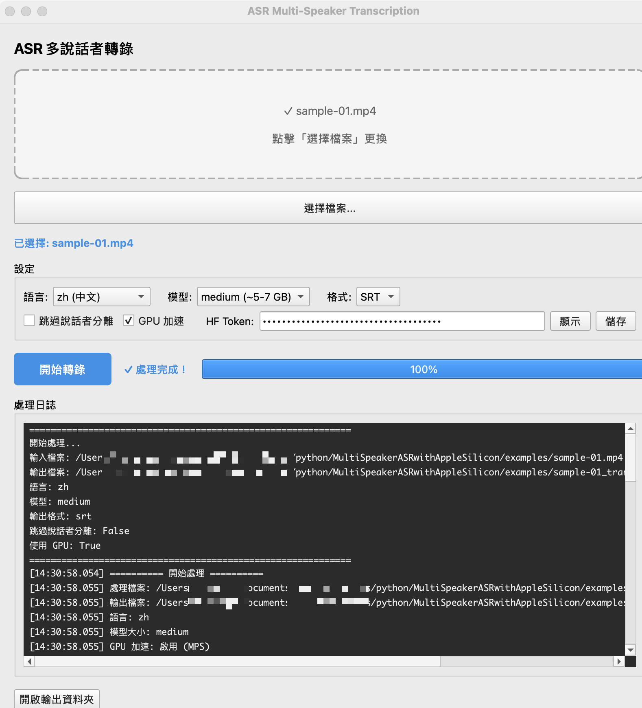
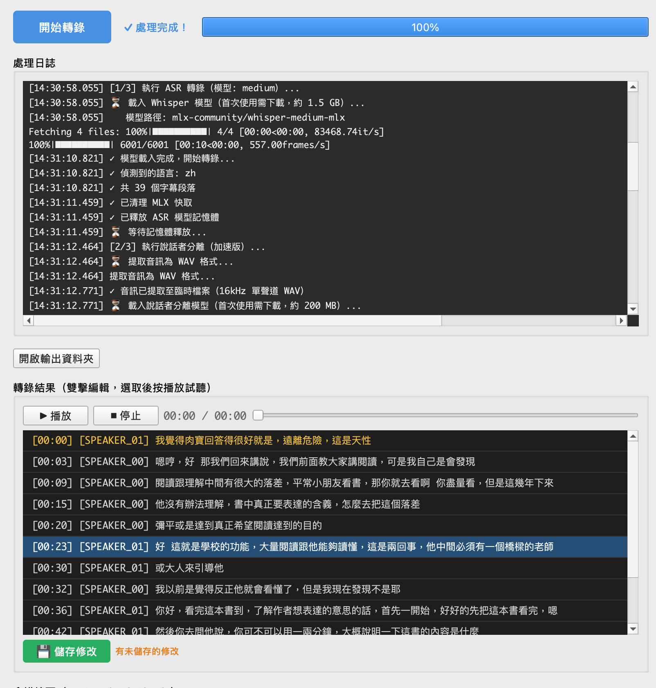
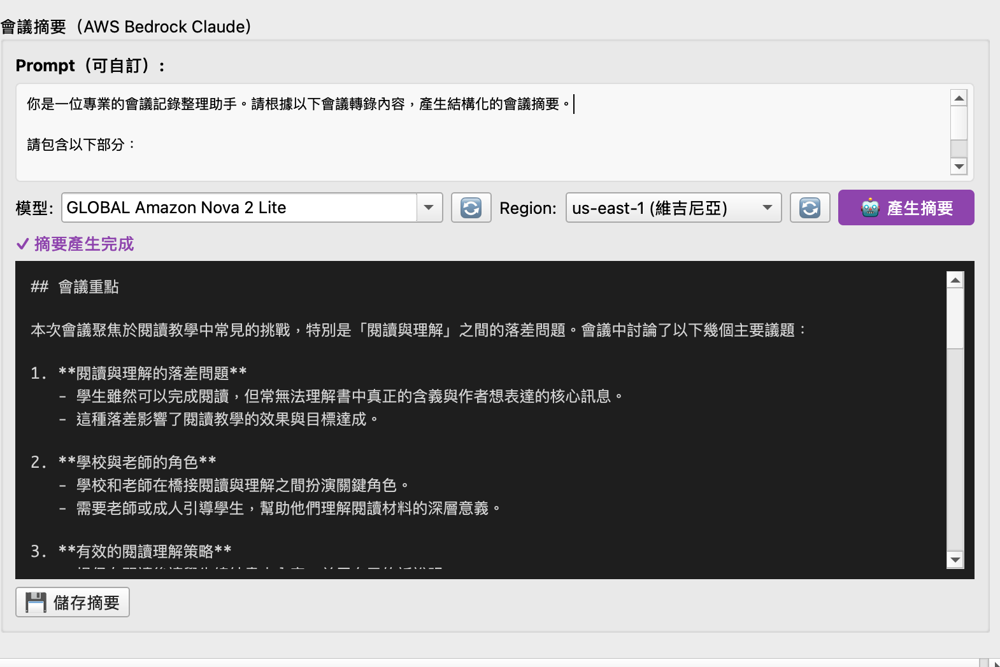

# ASR Multi-Speaker Transcription

🎙️ A speech transcription and speaker diarization tool using MLX Whisper and pyannote.audio, optimized for Apple Silicon Macs.

Features a user-friendly graphical interface with drag-and-drop support, real-time progress display, subtitle editing, AWS Bedrock summarization, and more.

## 📸 Feature Showcase

### Main Interface - File Selection and Parameter Configuration

- Drag and drop files or click to select
- Choose Whisper model size
- Set language and output format
- Enable/disable speaker diarization

### Transcription Results - Real-time Processing Logs and Subtitle Editing

- Real-time display of processing progress and logs
- Automatic speaker identification (SPEAKER_00, SPEAKER_01...)
- Built-in subtitle editor with double-click editing
- Audio player with subtitle click-to-jump

### AWS Bedrock Summarization Feature

- Generate meeting summaries using AWS Bedrock Claude
- Support for multiple AWS regions
- Customizable prompts
- One-click structured summary generation

## ✨ Key Features

- 🖥️ **User-Friendly GUI** - Drag-and-drop files, real-time progress, subtitle editing
- ⚡ **Apple Silicon Optimized** - 6x faster processing with MLX and MPS GPU acceleration
- 🎯 **Speaker Diarization** - Automatically identify and label different speakers
- 🌏 **Multi-Language Support** - Supports Chinese, English, Japanese, and more
- 📝 **Subtitle Editing** - Built-in subtitle editor for real-time modifications and saving
- 🎵 **Audio Playback** - Synchronized audio playback with subtitle click-to-jump
- 💾 **Multiple Formats** - Output in SRT or TXT format
- 🤖 **AI Summarization** - Integrated AWS Bedrock for automatic meeting summaries

## 🚀 Quick Start

### Method 1: Automatic Installation (Recommended)

```bash
# 1. Clone the project
git clone https://github.com/KenexAtWork/MultiSpeakerASRwithAppleSilicon.git
cd MultiSpeakerASRwithAppleSilicon

# 2. Run installation script
./install.sh

# 3. Edit .env file and add your Hugging Face Token
nano .env  # or use another editor

# 4. Launch GUI
./run_gui.sh
```

### Method 2: Manual Installation

```bash
# 1. Install system dependencies (if not already installed)
brew install ffmpeg

# 2. Install uv (Python package manager, 10-100x faster than pip)
curl -LsSf https://astral.sh/uv/install.sh | sh
source $HOME/.local/bin/env   # Add uv to current shell PATH

# 3. Clone the project
git clone https://github.com/KenexAtWork/MultiSpeakerASRwithAppleSilicon.git
cd MultiSpeakerASRwithAppleSilicon

# 4. Create virtual environment and install packages
uv venv --python 3.10
source .venv/bin/activate
uv pip install -e ".[all]"  # Install all features (GUI + AWS)

# 5. Configure environment variables
cp .env.example .env
nano .env  # Add your HF_TOKEN
```

### Setting Up Hugging Face Token

Speaker diarization requires a Hugging Face token:

1. Go to https://huggingface.co/settings/tokens to create a token
2. Accept the model usage terms:
   - https://huggingface.co/pyannote/speaker-diarization-3.1
   - https://huggingface.co/pyannote/segmentation-3.0
3. Add the token to your `.env` file: `HF_TOKEN=your_token_here`

**Detailed Tutorial:** [How to Apply for Hugging Face Token](https://ithelp.ithome.com.tw/articles/10389679)

### First Run Notes

⚠️ **First run will automatically download AI models (~1.7 GB)**

- Whisper speech recognition model: ~1.5 GB
- Speaker Diarization model: ~200 MB
- Download time: 2-8 minutes (depending on network speed)
- GUI may appear unresponsive during download, this is normal
- Models are automatically cached, subsequent launches are fast (< 5 seconds)

## 🎯 Using the GUI

### Basic Workflow

1. **Select File** - Drag and drop video/audio file, or click "Select File" button
2. **Configure Parameters** - Choose Whisper model, language, output format
3. **Start Transcription** - Click "Start Transcription" button
4. **View Results** - Subtitles will appear below after transcription completes
5. **Edit Subtitles** - Double-click subtitles to edit, click "Save SRT" after modifications
6. **Play Audio** - Click subtitles to jump to corresponding timestamp

### Parameter Descriptions

| Parameter | Description | Recommended Value |
|-----------|-------------|-------------------|
| **Whisper Model** | Affects accuracy and speed | `medium` (default) or `small` |
| **Language** | Primary audio language | `auto` (auto-detect) or `zh` (Chinese) |
| **Output Format** | Subtitle file format | `SRT` (standard subtitle format) |
| **Speaker Diarization** | Whether to identify different speakers | Checked (default) |
| **Region** | AWS region (for summarization) | `us-west-2` |

### Feature Descriptions

- **Drag and Drop** - Supports mp4, m4a, mov, avi, mkv, wav, mp3, and more
- **Real-time Progress** - Displays processing stage and progress percentage
- **Log Display** - Real-time display of processing steps and error messages
- **Subtitle Editing** - Double-click subtitles to edit content, supports multi-line text
- **Audio Playback** - Synchronized audio playback, click subtitles to jump to timestamp
- **Open Folder** - Quick access to output file location
- **AI Summarization** - Generate meeting summaries using AWS Bedrock Claude
  - Automatically reads AWS configuration (uses `default` profile)
  - Support for multiple AWS region selection
  - Customizable prompt templates
  - One-click structured summary generation

### AWS Summarization Setup

To use AWS Bedrock summarization:

1. **AWS Account** - Need an AWS account with Bedrock service enabled
2. **AWS CLI Configuration** - Configure AWS credentials:

```bash
# Install AWS CLI (if not already installed)
brew install awscli

# Configure AWS credentials (using default profile)
aws configure
# Enter:
#   AWS Access Key ID
#   AWS Secret Access Key
#   Default region name (e.g., us-west-2)
#   Default output format (json)
```

3. **Bedrock Permissions** - Ensure IAM user has Bedrock access permissions:
   - `bedrock:InvokeModel`
   - Recommended model: `anthropic.claude-3-sonnet-20240229-v1:0`

4. **Region Selection** - Select a region with Bedrock service in the GUI:
   - `us-east-1` (N. Virginia)
   - `us-west-2` (Oregon)
   - `ap-northeast-1` (Tokyo)
   - Other Bedrock-supported regions

**Note:** The program automatically reads the `default` profile from `~/.aws/credentials` and `~/.aws/config`.

For detailed usage instructions, see [GUI Usage Guide](gui/README.md).

## 💻 System Requirements

- macOS with Apple Silicon (M-series chips: M1, M2, M3, M4 or newer)
- Python 3.10+
- ffmpeg
- Hugging Face account (for speaker diarization)
- At least 8GB RAM (16GB recommended)

## 📖 Examples and Testing

The project includes sample videos and pre-processed output results:

```bash
# Test with sample video
./run_gui.sh
# Then drag examples/sample-01.mp4 into the GUI

# Or test via command line
./scripts/asr.sh examples/sample-01.mp4

# View sample output
cat examples/sample-output/sample-01_transcription.srt
```

The examples directory contains:
- `sample-01.mp4` - ~1 minute multi-speaker conversation video
- `sample-output/` - Pre-processed output results and screenshots

For detailed instructions, see [examples/README.md](examples/README.md)

## 🎨 Model Selection

MLX Whisper supports multiple model sizes, choose based on memory and accuracy needs:

| Model | Memory Usage | Accuracy | Speed | Use Case |
|-------|-------------|----------|-------|----------|
| `tiny` | ~1-2 GB | ⭐⭐ | Fastest | Quick testing, drafts |
| `base` | ~2-3 GB | ⭐⭐⭐ | Very fast | Simple conversations, memory-constrained |
| `small` | ~3-4 GB | ⭐⭐⭐⭐ | Fast | General meetings, recommended |
| `medium` | ~5-7 GB | ⭐⭐⭐⭐⭐ | Medium | Default, high-quality needs |
| `large` | ~8-10 GB | ⭐⭐⭐⭐⭐ | Slower | Highest accuracy needs |

**Selection Recommendations:**
- 8GB RAM Mac: Recommend `small` or `base`
- 16GB RAM Mac: Recommend `small` or `medium` (default)
- 32GB+ RAM Mac: Can use `large`
- Mixed Chinese-English speech: Recommend at least `small` or above

## 🌏 Language Support

Supports multiple languages, including:

- `auto`: Auto-detect (recommended for mixed languages)
- `zh`: Chinese
- `en`: English
- `ja`: Japanese
- `es`: Spanish
- `fr`: French
- `de`: German
- `it`: Italian
- `pt`: Portuguese
- `ru`: Russian
- `ko`: Korean

**Mixed Language Support:**
- For Chinese-English mixed audio, recommend selecting `auto` (auto-detect)
- If audio is primarily one language, specify that language
- Whisper can handle mixed-language audio, but accuracy depends on mixing ratio

## ⚡ Performance

Test results on M1 Pro (8-core CPU, 14-core GPU, 16GB RAM):

| Video Length | Processing Time | Speedup | Model |
|-------------|----------------|---------|-------|
| 90 seconds  | ~45 seconds    | 2.0x    | medium |
| 3 minutes   | ~55 seconds    | 3.3x    | medium |
| 14 minutes  | ~4.5 minutes   | 3.1x    | medium |
| 31 minutes  | ~10 minutes    | 3.1x    | medium |

**Performance Optimization:**
- GPU acceleration is ~6x faster than CPU
- Using `small` model can further improve speed (~1.5x)
- Disabling speaker diarization saves ~30% time

## 📝 Output Formats

### SRT Format (Default)

Standard subtitle format, can be used directly in video players:

```
1
00:00:00,000 --> 00:00:02,500
[SPEAKER_00] Please Peter, come explain

2
00:00:02,500 --> 00:00:04,200
[SPEAKER_00] I'll hand it over to Peter

3
00:00:06,239 --> 00:00:06,639
[SPEAKER_01] Okay
```

### TXT Format

Plain text format, suitable for reading and editing:

```
[SPEAKER_00] 00:00:00,000 --> 00:00:02,500
Please Peter, come explain

[SPEAKER_00] 00:00:02,500 --> 00:00:04,200
I'll hand it over to Peter

[SPEAKER_01] 00:00:06,239 --> 00:00:06,639
Okay
```

## 🔧 Advanced Usage: Command Line Version

If you prefer using the command line or need batch processing, use the command line version:

### Using Convenience Scripts

```bash
# Basic usage (auto-generate output filename)
./scripts/asr.sh video.mp4

# Specify output filename and format
./scripts/asr.sh video.mp4 output.srt
./scripts/asr.sh video.mp4 output.txt --format txt

# Specify language and model
./scripts/asr.sh video.mp4 output.srt --language zh --model small

# Skip speaker diarization (faster)
./scripts/asr.sh video.mp4 output.srt --skip-diarization

# Use CPU (no GPU)
./scripts/asr.sh video.mp4 output.srt --no-gpu
```

### Direct Python Script Execution

```bash
source .venv/bin/activate

python asr_multi_speaker_v5_fast.py \
  --input video.mp4 \
  --output output.srt \
  --language zh \
  --model medium \
  --hf-token YOUR_TOKEN
```

### Batch Processing Example

```bash
# Process all videos in a folder
for video in videos/*.mp4; do
  ./scripts/asr.sh "$video"
done
```

## 🎧 Recording Online Meetings (System Audio Capture)

To transcribe online meetings (Zoom, Teams, Google Meet, etc.), you need to capture system audio using a virtual audio device.

### Setup with BlackHole (Free, Open Source)

```bash
# Install BlackHole 2-channel
brew install blackhole-2ch
```

After installation:

1. Open **Audio MIDI Setup** (search in Spotlight)
2. Click **+** at bottom left → **Create Multi-Output Device**
3. Check both your speakers/headphones AND **BlackHole 2ch**
4. Set this Multi-Output Device as your system output (System Settings → Sound → Output)
5. In Realtime ASR, click **↻** to refresh devices, then select **BlackHole 2ch** as input

Now system audio (meeting voices) will be captured by the ASR.

**Tip:** To record both your mic and system audio simultaneously, create an **Aggregate Device** in Audio MIDI Setup that combines your mic + BlackHole.

### Alternative: Loopback (Paid)

[Loopback by Rogue Amoeba](https://rogueamoeba.com/loopback/) provides a more user-friendly interface for audio routing, but requires a paid license.

## ❓ Troubleshooting

### GUI Issues

**Problem: GUI won't start**
```bash
# Confirm PyQt6 is installed
source .venv/bin/activate
uv pip install PyQt6

# Check Python version (needs 3.10+)
python --version
```

**Problem: Drag and drop not responding**
- Confirm file format is supported (mp4, m4a, mov, avi, mkv, wav, mp3)
- Check if file path contains special characters
- Check log window for error messages

**Problem: Audio won't play**
- Confirm file path is correct
- Check for Chinese or special characters (now supported, but may need to reselect file)
- Check log window for error messages

**Problem: Can't save edited subtitles**
- Confirm write permissions
- Check if output path exists
- Try manually specifying output filename

### Transcription Issues

**Problem: ffmpeg not found**
```bash
brew install ffmpeg
```

**Problem: mlx module not found**

Confirm using ARM64 native Python:

```bash
file $(which python)
# Should show: Mach-O 64-bit executable arm64
```

If x86_64, recreate environment:

```bash
uv venv --python 3.10
source .venv/bin/activate
uv pip install -e .
```

**Problem: Speaker diarization fails**

1. Confirm HF_TOKEN is set (in .env file or GUI)
2. Confirm model usage terms accepted:
   - https://huggingface.co/pyannote/speaker-diarization-3.1
   - https://huggingface.co/pyannote/segmentation-3.0
3. Try unchecking "Speaker Diarization" option
4. Check network connection (first use requires model download)

**Problem: Slow processing**

1. Confirm GPU acceleration is enabled (default)
2. Try using smaller model (`small` or `base`)
3. Unchecking "Speaker Diarization" saves ~30% time
4. Close other resource-intensive applications

**Problem: Out of memory**

1. Use smaller model: `small` (3-4 GB) or `base` (2-3 GB)
2. Uncheck "Speaker Diarization"
3. Close other applications to free memory
4. Consider upgrading RAM (16GB recommended)

**Problem: Inaccurate transcription**

1. Try using larger model (`medium` or `large`)
2. Confirm language setting is correct (or use `auto`)
3. Check audio quality (background noise, volume)
4. For Chinese-English mixed, use `auto` language setting

**Problem: First run is very slow**

First run downloads models (~1.7 GB), takes 5-15 minutes. After model download completes, subsequent use is fast.

### Testing Issues

**Problem: Tests fail**

```bash
# Run test diagnostics
cd asr
./run_tests.sh --fast --verbose

# Check environment
source .venv/bin/activate
python -c "import mlx_whisper; print('MLX OK')"
python -c "import PyQt6; print('PyQt6 OK')"
```

## 🧪 Testing and Development

### Running Tests

```bash
# Quick test (~20 seconds)
./run_tests.sh --fast

# Full test (~60 seconds)
./run_tests.sh

# Run specific test only
./run_tests.sh --test pipeline
./run_tests.sh --test merge

# View test coverage
cat tests/TEST_COVERAGE.md
```

For detailed testing instructions, see [tests/README.md](tests/README.md)

### CI/CD

The project uses GitHub Actions for automated testing:
- Automatically runs on push to main/develop branches
- Test time ~16 seconds
- View test results: https://github.com/KenexAtWork/MultiSpeakerASRwithAppleSilicon/actions

## 📁 Project Structure

```
asr/
├── gui/                           # GUI application
│   ├── main.py                   # GUI main program
│   ├── ui/                       # UI components
│   │   └── main_window.py       # Main window
│   └── core/                     # Core logic
│       ├── asr_worker.py        # ASR processing thread
│       └── summary_worker.py    # Summary generation thread
├── tests/                        # Automated tests
│   ├── test_pipeline_e2e.py    # Pipeline end-to-end test
│   ├── test_merge_srt.py       # Merge logic test
│   ├── test_gui_display.py     # GUI display test
│   ├── test_gui_processing.py  # GUI processing test
│   ├── test_gui_media_url.py   # GUI media player test
│   ├── test_srt_parser.py      # SRT parser test
│   ├── test_error_handling.py  # Error handling test
│   └── TEST_COVERAGE.md        # Test coverage documentation
├── scripts/                      # Script tools
│   ├── asr.sh                   # Command line convenience script
│   ├── asr_chunked.sh           # Chunked processing script
│   ├── benchmark.sh             # Performance test script
│   ├── ci_test.sh               # CI/CD test script
│   └── cleanup_for_git.sh       # Git cleanup script
├── examples/                     # Example files
│   ├── sample-01.mp4            # Sample video
│   └── sample-output/           # Sample output results
├── screenshots/                  # GUI screenshots
│   ├── 01-main-interface.png
│   ├── 02-transcription-result.png
│   └── 03-aws-summary.png
├── asr_multi_speaker_v5_fast.py # Main program (command line version)
├── merge_srt.py                 # SRT merge module
├── install.sh                   # Auto installation script
├── run_gui.sh                   # GUI launch script
├── run_tests.sh                 # Test execution script
├── pyproject.toml               # Python project configuration
├── .env.example                 # Environment variable example
├── .gitignore                   # Git ignore file
├── README.md                    # This file
├── COMPARISON.md                # Comparison with WhisperX
└── LICENSE                      # MIT License
```

## 🤝 Contributing

Issues and Pull Requests are welcome!

### Development Workflow

1. Fork the project
2. Create feature branch (`git checkout -b feature/amazing-feature`)
3. Commit changes (`git commit -m 'Add amazing feature'`)
4. Push to branch (`git push origin feature/amazing-feature`)
5. Open Pull Request

### Testing Requirements

Before submitting PR, ensure:
- All tests pass (`./run_tests.sh`)
- New features have corresponding tests
- Code follows project style

## 📊 Comparison with WhisperX

This project and [WhisperX](https://github.com/m-bain/whisperX) both use pyannote.audio for speaker diarization, but have the following key differences:

| Feature | This Project | WhisperX |
|---------|-------------|----------|
| **Hardware Optimization** | Apple Silicon (MPS) | NVIDIA GPU (CUDA) |
| **User Interface** | GUI + Command Line | Command Line |
| **Timestamp Precision** | ±0.1-0.5 seconds | ±0.01-0.05 seconds (forced alignment) |
| **Cross-Platform** | macOS only (Apple Silicon) | Linux, Windows, macOS |
| **Processing Speed** | Fast (M1 native) | Very fast (CUDA) |
| **Features** | ASR + Speaker Diarization + Subtitle Editing | ASR + Speaker Diarization + Translation + Batch |
| **Installation** | Simple | Medium |

**Choose this project if you:**
- ✅ Use Apple Silicon Mac
- ✅ Want a user-friendly GUI
- ✅ Need subtitle editing features
- ✅ Need fastest processing speed on Mac

**Choose WhisperX if you:**
- ✅ Use NVIDIA GPU
- ✅ Need millisecond-level timestamp precision
- ✅ Need translation and batch processing features

For detailed comparison, see [COMPARISON.md](COMPARISON.md)

## 📄 License

MIT License - See [LICENSE](LICENSE) file

## 🙏 Acknowledgments

- [MLX Whisper](https://github.com/ml-explore/mlx-examples/tree/main/whisper) - Apple Silicon optimized Whisper implementation
- [pyannote.audio](https://github.com/pyannote/pyannote-audio) - Speaker diarization model
- [OpenAI Whisper](https://github.com/openai/whisper) - Original Whisper model
- [PyQt6](https://www.riverbankcomputing.com/software/pyqt/) - GUI framework

## 📝 Changelog

### v5.1 (2026-02-23)
- ✨ Added PyQt6 graphical interface
- ✨ Support for subtitle editing and audio playback
- ✨ Added paragraph merging (same speaker)
- ✨ Complete automated test suite (54% coverage)
- ✨ GitHub Actions CI/CD integration
- 🐛 Fixed Chinese filename audio playback issue
- 🐛 Fixed language=auto crash issue

### v5.0 (2025-02-05)
- ✨ Added MPS GPU acceleration support
- ⚡ Increased CPU threads to 8
- 🚀 6x performance improvement

### v4.0 (2025-02-04)
- ✨ Support for pyannote.audio 4.x API
- 🐛 Fixed PyTorch 2.6+ weights_only issue
- 🔧 Optimized for M1 Mac

### v3.0 (2025-02-04)
- ✨ Use subprocess to isolate speaker diarization
- 🐛 Fixed segmentation fault issue

### v2.0 (2025-02-04)
- ✨ Initial version
- 🎯 Support for multi-speaker diarization

---

**Project Maintainer:** [@KenexAtWork](https://github.com/KenexAtWork)

**Issue Reporting:** https://github.com/KenexAtWork/MultiSpeakerASRwithAppleSilicon/issues
